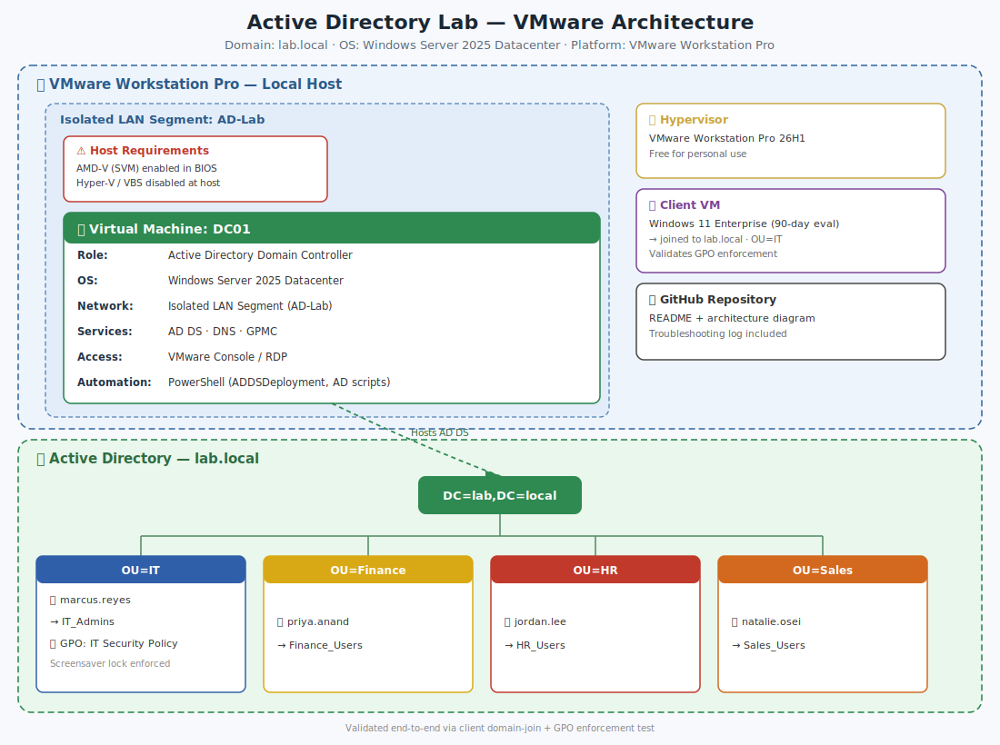

# Active Directory Domain Services Lab — Identity & Access Management Foundation


A self-built Active Directory environment deployed entirely on local virtualization (VMware Workstation Pro), covering domain controller promotion, organizational unit design, security group structure, role-based account provisioning, and Group Policy enforcement validated against a domain-joined client — the same identity and access management fundamentals that underpin most enterprise Windows and hybrid-cloud environments.

---

## Watch the demo here 


## 1. The Problem This Lab Solves

Every organization running Windows infrastructure depends on Active Directory to answer one question: **who is allowed to do what?**

AD is the identity backbone for an enterprise. It governs which users can log into which machines, which groups can reach which resources, and which policies apply to which parts of the business. Onboarding adds an account to the right groups; offboarding disables one account and every access path closes at once. The same model carries forward into hybrid environments, where on-prem AD syncs to Microsoft Entra ID — meaning this lab maps directly onto cloud identity work, not just legacy infrastructure.

| Role | How this lab applies |
|---|---|
| IT Support / Help Desk | Password resets, account unlocks, group changes — the highest-volume ticket types in any enterprise |
| Sysadmin | OU design and GPO deployment at scale |
| Cloud Engineer | Entra ID uses the same primitives (users, groups, roles, conditional access) — on-prem AD knowledge transfers directly |
| Security Analyst | AD is the most targeted system in ransomware attacks; understanding it is the baseline for defending it |

---

## 2. Architecture

The diagram below shows the environment as built: a Windows Server VM promoted to a Domain Controller on a local hypervisor, with the resulting forest, organizational structure, security groups, and Group Policy enforcement validated against a domain-joined client.



**Trust boundary:** the Domain Controller is the single authoritative source for authentication and DNS inside `lab.local`. The client VM only trusts the domain because its DNS was explicitly pointed at the DC and its computer object was moved into the `IT` OU — without both of those, the GPO would never have reached it. Every OU, group, user, and policy in the diagram exists because the DC trusts and enforces it; nothing authenticates independently of it.

---

## 3. Environment

| Field | Value |
|---|---|
| Hypervisor | VMware Workstation Pro 26H1 (local, free for personal use) — initially attempted on VirtualBox, switched after hypervisor/security-layer conflicts (see Section 6) |
| Domain Controller VM | Windows Server 2025 Datacenter, Desktop Experience — 2 vCPU, 4GB RAM, 60GB disk |
| Client VM | Windows 11 Enterprise (90-day evaluation) — used to validate domain join and GPO enforcement |
| Network | Isolated LAN Segment (`AD-Lab`) — DC running AD DS + DNS, client's DNS pointed at the DC |
| Domain | `lab.local` (single forest, single domain) |
| Cost | $0 — Workstation Pro is free for personal use; Windows Server/11 run on evaluation licenses |
| Host prerequisites | AMD-V (SVM Mode) enabled in BIOS; Windows-native virtualization (Hyper-V/VBS) disabled or bypassed at the host level |
| Certification alignment | CompTIA Network+, Security+ · Microsoft Azure Administrator (on-prem AD concepts map directly to Entra ID) |

---

## 4. Build Process

### 4.1 Provision the VM
Initially attempted on VirtualBox; switched to VMware Workstation Pro after running into layered host-level virtualization conflicts (full breakdown in Section 6). Final build: a Windows Server 2025 Datacenter (Desktop Experience) VM on VMware Workstation Pro, allocated 2 vCPU / 4GB RAM / 60GB disk, network adapter on NAT for initial setup before moving to an isolated LAN Segment.

### 4.2 Install AD DS + Group Policy Management Console
```powershell
Install-WindowsFeature -Name AD-Domain-Services -IncludeManagementTools
Install-WindowsFeature -Name GPMC
```

### 4.3 Promote to Domain Controller
```powershell
Import-Module ADDSDeployment
Install-ADDSForest `
  -DomainName 'lab.local' `
  -DomainNetBiosName 'LAB' `
  -InstallDns:$true `
  -SafeModeAdministratorPassword (ConvertTo-SecureString 'YourDSRMPassword!' -AsPlainText -Force) `
  -Force:$true
```
This creates the forest and domain, and makes the VM the authoritative identity and DNS server for everything that joins it.

### 4.4 Build the OU structure
```powershell
New-ADOrganizationalUnit -Name "IT"        -Path "DC=lab,DC=local"
New-ADOrganizationalUnit -Name "Finance"   -Path "DC=lab,DC=local"
New-ADOrganizationalUnit -Name "HR"        -Path "DC=lab,DC=local"
New-ADOrganizationalUnit -Name "Sales"     -Path "DC=lab,DC=local"
New-ADOrganizationalUnit -Name "Computers" -Path "DC=lab,DC=local"
```

### 4.5 Create security groups (RBAC)
```powershell
New-ADGroup -Name "IT_Admins"     -GroupScope Global -GroupCategory Security -Path "OU=IT,DC=lab,DC=local"
New-ADGroup -Name "Finance_Users" -GroupScope Global -GroupCategory Security -Path "OU=Finance,DC=lab,DC=local"
New-ADGroup -Name "HR_Users"      -GroupScope Global -GroupCategory Security -Path "OU=HR,DC=lab,DC=local"
New-ADGroup -Name "Sales_Users"   -GroupScope Global -GroupCategory Security -Path "OU=Sales,DC=lab,DC=local"
```

### 4.6 Provision users and assign group membership
```powershell
$password = ConvertTo-SecureString "Welcome@2026!" -AsPlainText -Force

New-ADUser -Name "marcus.reyes" -GivenName "Marcus" -Surname "Reyes" `
  -SamAccountName "marcus.reyes" -UserPrincipalName "marcus.reyes@lab.local" `
  -Path "OU=IT,DC=lab,DC=local" -AccountPassword $password -Enabled $true

New-ADUser -Name "priya.anand" -GivenName "Priya" -Surname "Anand" `
  -SamAccountName "priya.anand" -UserPrincipalName "priya.anand@lab.local" `
  -Path "OU=Finance,DC=lab,DC=local" -AccountPassword $password -Enabled $true

New-ADUser -Name "jordan.lee" -GivenName "Jordan" -Surname "Lee" `
  -SamAccountName "jordan.lee" -UserPrincipalName "jordan.lee@lab.local" `
  -Path "OU=HR,DC=lab,DC=local" -AccountPassword $password -Enabled $true

New-ADUser -Name "natalie.osei" -GivenName "Natalie" -Surname "Osei" `
  -SamAccountName "natalie.osei" -UserPrincipalName "natalie.osei@lab.local" `
  -Path "OU=Sales,DC=lab,DC=local" -AccountPassword $password -Enabled $true

Add-ADGroupMember -Identity "IT_Admins"     -Members "marcus.reyes"
Add-ADGroupMember -Identity "Finance_Users" -Members "priya.anand"
Add-ADGroupMember -Identity "HR_Users"      -Members "jordan.lee"
Add-ADGroupMember -Identity "Sales_Users"   -Members "natalie.osei"
```

### 4.7 Configure and link Group Policy
Created **IT Security Policy**, linked to the `IT` OU, enforcing:

| Setting | Value | Purpose |
|---|---|---|
| Minimum password length | 12 | Enforce strong credentials across IT accounts |
| Password complexity | Enabled | Requires upper, lower, number, and symbol |
| Machine inactivity limit | 900 seconds | Auto-lock after 15 minutes idle |
| Removable storage access | Deny all | Mitigate data exfiltration via USB |

Validated by joining a Windows 11 client VM to `lab.local` — full process in 4.8 below.

### 4.8 Domain-join a client VM and validate GPO enforcement
A Domain Controller can't validate its own policies — they only mean something once a client machine pulls them down. I deliberately used a second VM (Windows 11 Enterprise, 90-day eval) rather than my physical host for this, since the GPO includes a USB-deny rule and a forced inactivity lock that I didn't want enforced on my actual machine.

1. **Network alignment** — set both VMs to the same isolated LAN Segment (`AD-Lab`) so the client and DC could see each other without touching the home network.
2. **DNS pointer** — on the client, set the Preferred DNS server to the DC's IPv4 address (kept the IP address itself on automatic/DHCP) so `lab.local` would actually resolve.
3. **Domain join** — `sysdm.cpl` → Change → Domain → `lab.local`, authenticated as `LAB\Administrator`, restarted on prompt.
4. **Targeted the computer object** — in ADUC, moved the new computer object out of the default `Computers` container and into the `IT` OU, since policies only apply to objects inside the OU they're linked to.
5. **Logged in as `marcus.reyes@lab.local`** on the client and ran:
```powershell
gpupdate /force
gpresult /r
```
6. **Confirmed enforcement** — `IT Security Policy` appeared under Applied Group Policy Objects, the screen auto-locked after 15 minutes of inactivity, and attaching a virtual USB device returned an Access Denied prompt.

---

## 5. Verification

| Check | Command | Expected Result |
|---|---|---|
| Domain controller is running | `Get-ADDomainController` | Returns DC info for forest `lab.local` |
| OUs exist | `Get-ADOrganizationalUnit -Filter *` | Lists all 5 OUs |
| Users exist and are enabled | `Get-ADUser -Filter {Enabled -eq $true}` | Lists all 4 accounts |
| Group membership correct | `Get-ADGroupMember -Identity IT_Admins` | Returns `marcus.reyes` |
| GPO is linked | `Get-GPInheritance -Target 'OU=IT,DC=lab,DC=local'` | Shows `IT Security Policy` as linked |

---

## 6. Issues I Ran Into (and Worked Through with Gemini)

I used Gemini as a real-time troubleshooting partner for this build, and almost none of the friction came from Active Directory itself — it came from getting a hypervisor to boot on a host that Windows was actively trying to lock down. Several of these "fixes" weren't enough on their own; it took layered fixes before the VM would even power on. Documenting the full sequence because it's a more realistic troubleshooting exercise than anything in the original lab's official troubleshooting table.

### Hypervisor & virtualization setup
| Issue | Root Cause | Resolution |
|---|---|---|
| VirtualBox wouldn't power on the VM — `VERR_SVM_DISABLED` / `VERR_NEM_NOT_AVAILABLE` | AMD-V (SVM Mode) was disabled at the BIOS/motherboard level | Rebooted into BIOS/UEFI and enabled SVM Mode under CPU Configuration |
| Same error persisted after enabling SVM | Initially suspected Windows' "Virtual Machine Platform" / "Windows Hypervisor Platform" features — both were already off, so that wasn't it. Windows was locking the hypervisor layer silently through a deeper layer (Core Isolation, Credential Guard, Virtualization-Based Security) instead | Ruled out the visible Windows Features toggles and targeted the hidden layer directly |
| `bcdedit /set hypervisorlaunchtype off` returned "Access is denied" | Command Prompt wasn't elevated; also tried `sudo`, which doesn't exist in Windows CMD | Re-ran Command Prompt as Administrator, then re-ran the same command successfully |
| VirtualBox still failed after the `bcdedit` fix | Decided to stop chasing VirtualBox-specific hypervisor conflicts | Switched to VMware Workstation Pro 26H1 (free for personal use, supersedes the old v17 licensing) |
| VMware reported "This host supports AMD-V, but AMD-V is disabled" | Virtualization-Based Security (VBS) was still masking the CPU's virtualization flags from third-party hypervisors, even with the Hyper-V launch type set to off | Performed a full cold boot (Shift+Shutdown, not a normal restart) to clear the CPU hardware register cache — Windows "Fast Startup" doesn't fully reset hardware state on a normal reboot |
| VBS still active after the cold boot | The `EnableVirtualizationBasedSecurity` registry key didn't exist under `DeviceGuard`, so Windows defaulted to enabling VBS automatically | Created the key manually (`reg add HKLM\SYSTEM\CurrentControlSet\Control\DeviceGuard /v EnableVirtualizationBasedSecurity /t REG_DWORD /d 0 /f`) and rebooted |
| AMD-V still reported disabled inside VMware after all of the above | Host-level masking persisted despite the BIOS, boot-config, and registry changes | Edited the VM's `.vmx` configuration file directly and added `monitor.allowLegacyAsymmetricNestedPageTable = "TRUE"`, forcing VMware to run despite the masked CPU flag — this was the fix that actually let the VM boot |

### Domain promotion & client networking
| Issue | Root Cause | Resolution |
|---|---|---|
| Domain promotion blocked: "local Administrator account password does not meet requirements... currently blank" | AD DS promotion upgrades the local Administrator account to Domain Admin and refuses a blank password on security grounds | Set a strong local Administrator password (`net user Administrator Welcome@2026!`) and reran the prerequisites check |
| Yellow warnings during promotion (DNS delegation, no static IP assigned) | Both are expected for an isolated lab domain on a DHCP-assigned NIC, not actual failures | Confirmed both were safe to proceed past — DNS delegation doesn't apply to a private domain, and the static IP was handled afterward |
| Client VM couldn't resolve `lab.local` | The client's network adapter was still using VMware's default DHCP-assigned DNS server instead of the Domain Controller's IP | Manually set the client's Preferred DNS server to the DC's IPv4 address while leaving the IP address itself on automatic |
| "Microsoft TCP/IP" warning when editing the client's network settings | Accidentally selected "Use the following IP address" while leaving the static IP fields blank | Switched back to "Obtain an IP address automatically" and only set the DNS field manually |
| Considered joining the physical host PC to the domain to test the GPO | Realized the GPO includes a USB-deny policy and a 15-minute inactivity lock — applying that to the actual machine would be disruptive and hard to cleanly reverse, and the host would also lose DNS resolution entirely if the DC VM ever shut down | Stood up a second VM (Windows 11 Enterprise, 90-day eval) as the test client instead, keeping the GPO's blast radius contained to the lab |
| Windows 11 client setup forced a Microsoft account / internet connection requirement | The lab network wasn't internet-routed at that point in setup | Used `Shift+F10` during OOBE to open a command prompt and ran `OOBE\BYPASSNRO`, which exposed the offline/local-account setup path |

The recurring lesson across all of this: the actual Active Directory commands worked exactly as documented every time. Every real blocker was a sequencing or trust-boundary issue one layer below AD — BIOS settings, Windows' own hidden virtualization security, DNS resolution order, or which OU a computer object sits in. That's arguably a more useful thing to have debugged hands-on than if the lab had gone smoothly.

---

## 7. Skills Demonstrated

- Domain Controller deployment and forest/domain design (`lab.local`)
- Organizational Unit structuring for departmental policy boundaries
- Role-based access control via security groups (least-privilege grouping model)
- User lifecycle management — provisioning, password reset, account lockout/unlock, disablement
- Group Policy authoring and enforcement (password policy, session lock, removable media restriction)
- PowerShell-based AD administration (`ActiveDirectory`, `ADDSDeployment`, `GroupPolicy` modules)
- Hypervisor and host-level virtualization troubleshooting (BIOS/SVM, Windows VBS, hypervisor boot configuration)
- Network segmentation and DNS configuration for an isolated AD lab (LAN segment design, client DNS pointing)
- End-to-end policy validation — joining a client to the domain and confirming GPO enforcement, not just configuration

---

## 8. Author

**Ifeanyichukwu R. (Raymond) Ezirike**
B.S. Information Technology, Network Security — Towson University
[LinkedIn](#) · [GitHub](#)

